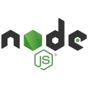

<!--  - 👋 Hi, I’m @theshubh007 Shubham Kothiya
- 👀 I’m interested in AI/ML
- 🌱 LangChain, DataScience, Flask ,Flutter, Nodejs, Springboot, Docker, Aws.
- My Applications on playstore:
   1.https://play.google.com/store/apps/details?id=com.shubh.Docoheal
   2.https://play.google.com/store/apps/details?id=com.shubh.codingzone
- My VsCode Extension:
     https://marketplace.visualstudio.com/items?itemName=ShubhamKothiya.Wise-Analyst 
- 📫 How to reach me :https://www.linkedin.com/in/shubham-kothiya-7999451b9/
 -->

 

    
<!-- -->

    

 <article class="markdown-body entry-content container-lg f5" itemprop="text"><h1 align="center" dir="auto"><a id="user-content-hi--im-abhishek-bhatt" class="anchor" aria-hidden="true" href="#hi--im-abhishek-bhatt"><svg class="octicon octicon-link" viewBox="0 0 16 16" version="1.1" width="16" height="16" aria-hidden="true"><path d="m7.775 3.275 1.25-1.25a3.5 3.5 0 1 1 4.95 4.95l-2.5 2.5a3.5 3.5 0 0 1-4.95 0 .751.751 0 0 1 .018-1.042.751.751 0 0 1 1.042-.018 1.998 1.998 0 0 0 2.83 0l2.5-2.5a2.002 2.002 0 0 0-2.83-2.83l-1.25 1.25a.751.751 0 0 1-1.042-.018.751.751 0 0 1-.018-1.042Zm-4.69 9.64a1.998 1.998 0 0 0 2.83 0l1.25-1.25a.751.751 0 0 1 1.042.018.751.751 0 0 1 .018 1.042l-1.25 1.25a3.5 3.5 0 1 1-4.95-4.95l2.5-2.5a3.5 3.5 0 0 1 4.95 0 .751.751 0 0 1-.018 1.042.751.751 0 0 1-1.042.018 1.998 1.998 0 0 0-2.83 0l-2.5 2.5a1.998 1.998 0 0 0 0 2.83Z"></path></svg></a>Hey there <g-emoji class="g-emoji" alias="wave" fallback-src="https://github.githubassets.com/images/icons/emoji/unicode/1f44b.png">👋</g-emoji>, I'm Shubham Kothiya</h1>
<h3 align="center" dir="auto"><a id="user-content-self-motivated-quick-learner-and-tech-savvy-professional-who-believes-in-upgrading-skills-and-knowledge-levels-as-continuous-process-to-handle-new-technologies" class="anchor" aria-hidden="true" href="#self-motivated-quick-learner-and-tech-savvy-professional-who-believes-in-upgrading-skills-and-knowledge-levels-as-continuous-process-to-handle-new-technologies"><svg class="octicon octicon-link" viewBox="0 0 16 16" version="1.1" width="16" height="16" aria-hidden="true"><path d="m7.775 3.275 1.25-1.25a3.5 3.5 0 1 1 4.95 4.95l-2.5 2.5a3.5 3.5 0 0 1-4.95 0 .751.751 0 0 1 .018-1.042.751.751 0 0 1 1.042-.018 1.998 1.998 0 0 0 2.83 0l2.5-2.5a2.002 2.002 0 0 0-2.83-2.83l-1.25 1.25a.751.751 0 0 1-1.042-.018.751.751 0 0 1-.018-1.042Zm-4.69 9.64a1.998 1.998 0 0 0 2.83 0l1.25-1.25a.751.751 0 0 1 1.042.018.751.751 0 0 1 .018 1.042l-1.25 1.25a3.5 3.5 0 1 1-4.95-4.95l2.5-2.5a3.5 3.5 0 0 1 4.95 0 .751.751 0 0 1-.018 1.042.751.751 0 0 1-1.042.018 1.998 1.998 0 0 0-2.83 0l-2.5 2.5a1.998 1.998 0 0 0 0 2.83Z"></path></svg></a>With a passion for creating innovative products and a commitment to staying at the forefront of change, I bring my A-game to every project, solving complex problems and crafting cutting-edge tech that transforms lives..</h3>

- 🔭 Checkout [Roamify](https://play.google.com/store/apps/details?id=com.shubh.Roamify)  [WiseAnalyst](https://github.com/theshubh007/wise-analyst)

- 🌱 I’m currently learning **GenAI, ML, NLP ,Docker,Aws**

- 👯  My VScode Extension:
       [wise-analyst](https://marketplace.visualstudio.com/items?itemName=ShubhamKothiya.Wise-Analyst)
  
- 🤝 I’m looking for help with [RetailQueryGen-AI](https://github.com/theshubh007/RetailQueryGen-AI) [Article_Research_Tool](https://github.com/theshubh007/Article_Research_Tool_Based_on_OpenSouceLLMs) [Ether-VotingDApp](https://github.com/theshubh007/Ether-VotingDApp), [Equalista](https://github.com/theshubh007/Equalista),  [Codingzone-App](https://github.com/theshubh007/Codingzone-App),  [SavvyNurse](https://github.com/theshubh007/savvynurse), 
  
- 💬 Ask me about **Langchain, Python, Flask, DSA,C++,Flutter**

- 📫 How to reach me **shubhamkothiya007@gmail.com**

  

<h2 dir="auto"><a id="user-content-----about-me" class="anchor" aria-hidden="true" href="#----about-me"><svg class="octicon octicon-link" viewBox="0 0 16 16" version="1.1" width="16" height="16" aria-hidden="true"><path d="m7.775 3.275 1.25-1.25a3.5 3.5 0 1 1 4.95 4.95l-2.5 2.5a3.5 3.5 0 0 1-4.95 0 .751.751 0 0 1 .018-1.042.751.751 0 0 1 1.042-.018 1.998 1.998 0 0 0 2.83 0l2.5-2.5a2.002 2.002 0 0 0-2.83-2.83l-1.25 1.25a.751.751 0 0 1-1.042-.018.751.751 0 0 1-.018-1.042Zm-4.69 9.64a1.998 1.998 0 0 0 2.83 0l1.25-1.25a.751.751 0 0 1 1.042.018.751.751 0 0 1 .018 1.042l-1.25 1.25a3.5 3.5 0 1 1-4.95-4.95l2.5-2.5a3.5 3.5 0 0 1 4.95 0 .751.751 0 0 1-.018 1.042.751.751 0 0 1-1.042.018 1.998 1.998 0 0 0-2.83 0l-2.5 2.5a1.998 1.998 0 0 0 0 2.83Z"></path></svg></a><themed-picture data-catalyst-inline="true"><picture>   </picture></themed-picture> About me</h2>

<themed-picture data-catalyst-inline="true"><picture> </picture></themed-picture>

  

<ul dir="auto">
<li><g-emoji class="g-emoji" alias="school" fallback-src="https://github.githubassets.com/images/icons/emoji/unicode/1f3eb.png">🏫</g-emoji> I am a <code>Student</code> 1st year MSSE(DataScience) at SanJose State University .</li>
<li><g-emoji class="g-emoji" alias="trophy" fallback-src="https://github.githubassets.com/images/icons/emoji/unicode/1f3c6.png">🏆</g-emoji>I was Lead of Google developer Student Club -PPSU Community 2022-2023</li>
<!-- <li><g-emoji class="g-emoji" alias="technologist" fallback-src="https://github.githubassets.com/images/icons/emoji/unicode/1f9d1-1f4bb.png">🧑‍💻</g-emoji> I love open-source contribution.</li> -->
<li><g-emoji class="g-emoji" alias="computer" fallback-src="https://github.githubassets.com/images/icons/emoji/unicode/1f4bb.png">💻</g-emoji> I am a competitive programmer at <a href="https://www.codechef.com/users/kingshubh_07"><code>Codechef</code></a>,<a href="https://auth.geeksforgeeks.org/user/thekingshubh07/practice/" <code>GFG</code></a>, <a href="https://leetcode.com/shubhamkothiya007/"><code>Leetcode</code></a>.</li>

<li><g-emoji class="g-emoji" alias="nerd_face" fallback-src="https://github.githubassets.com/images/icons/emoji/unicode/1f913.png">🤓</g-emoji>  Forever, a learner...</code>.</li>

</ul>
 

<h2 dir="auto"><a id="user-content----connect-with-me" class="anchor" aria-hidden="true" href="#---connect-with-me"><svg class="octicon octicon-link" viewBox="0 0 16 16" version="1.1" width="16" height="16" aria-hidden="true"><path d="m7.775 3.275 1.25-1.25a3.5 3.5 0 1 1 4.95 4.95l-2.5 2.5a3.5 3.5 0 0 1-4.95 0 .751.751 0 0 1 .018-1.042.751.751 0 0 1 1.042-.018 1.998 1.998 0 0 0 2.83 0l2.5-2.5a2.002 2.002 0 0 0-2.83-2.83l-1.25 1.25a.751.751 0 0 1-1.042-.018.751.751 0 0 1-.018-1.042Zm-4.69 9.64a1.998 1.998 0 0 0 2.83 0l1.25-1.25a.751.751 0 0 1 1.042.018.751.751 0 0 1 .018 1.042l-1.25 1.25a3.5 3.5 0 1 1-4.95-4.95l2.5-2.5a3.5 3.5 0 0 1 4.95 0 .751.751 0 0 1-.018 1.042.751.751 0 0 1-1.042.018 1.998 1.998 0 0 0-2.83 0l-2.5 2.5a1.998 1.998 0 0 0 0 2.83Z"></path></svg></a><themed-picture data-catalyst-inline="true"><picture>  </picture></themed-picture> Connect with me</h2>

	
	
	

<h3 align="left">Languages and Tools:</h3>

  
 
 
 
 
 	
 

 
 

 

## 🌟 Online Coding Profiles:

 

 <h3 dir="auto"><a id="user-content--️-hactoberfest-badges-" class="anchor" aria-hidden="true" href="#-️-hactoberfest-badges-"><svg class="octicon octicon-link" viewBox="0 0 16 16" version="1.1" width="16" height="16" aria-hidden="true"><path d="m7.775 3.275 1.25-1.25a3.5 3.5 0 1 1 4.95 4.95l-2.5 2.5a3.5 3.5 0 0 1-4.95 0 .751.751 0 0 1 .018-1.042.751.751 0 0 1 1.042-.018 1.998 1.998 0 0 0 2.83 0l2.5-2.5a2.002 2.002 0 0 0-2.83-2.83l-1.25 1.25a.751.751 0 0 1-1.042-.018.751.751 0 0 1-.018-1.042Zm-4.69 9.64a1.998 1.998 0 0 0 2.83 0l1.25-1.25a.751.751 0 0 1 1.042.018.751.751 0 0 1 .018 1.042l-1.25 1.25a3.5 3.5 0 1 1-4.95-4.95l2.5-2.5a3.5 3.5 0 0 1 4.95 0 .751.751 0 0 1-.018 1.042.751.751 0 0 1-1.042.018 1.998 1.998 0 0 0-2.83 0l-2.5 2.5a1.998 1.998 0 0 0 0 2.83Z"></path></svg></a> <g-emoji class="g-emoji" alias="medal_military" fallback-src="https://github.githubassets.com/images/icons/emoji/unicode/1f396.png">🎖️</g-emoji> Hactoberfest badges </h3>

  

## <picture>   </picture> Github Stats

&nbsp;

<!-- 
  

<h2 dir="auto"><a id="user-content--a-snake-eating-my-contributions-graph" class="anchor" aria-hidden="true" href="#-a-snake-eating-my-contributions-graph"><svg class="octicon octicon-link" viewBox="0 0 16 16" version="1.1" width="16" height="16" aria-hidden="true"><path d="m7.775 3.275 1.25-1.25a3.5 3.5 0 1 1 4.95 4.95l-2.5 2.5a3.5 3.5 0 0 1-4.95 0 .751.751 0 0 1 .018-1.042.751.751 0 0 1 1.042-.018 1.998 1.998 0 0 0 2.83 0l2.5-2.5a2.002 2.002 0 0 0-2.83-2.83l-1.25 1.25a.751.751 0 0 1-1.042-.018.751.751 0 0 1-.018-1.042Zm-4.69 9.64a1.998 1.998 0 0 0 2.83 0l1.25-1.25a.751.751 0 0 1 1.042.018.751.751 0 0 1 .018 1.042l-1.25 1.25a3.5 3.5 0 1 1-4.95-4.95l2.5-2.5a3.5 3.5 0 0 1 4.95 0 .751.751 0 0 1-.018 1.042.751.751 0 0 1-1.042.018 1.998 1.998 0 0 0-2.83 0l-2.5 2.5a1.998 1.998 0 0 0 0 2.83Z"></path></svg></a><g-emoji class="g-emoji" alias="snake" fallback-src="https://github.githubassets.com/images/icons/emoji/unicode/1f40d.png">🐍</g-emoji> A Snake Eating my Contributions Graph</h2>

	

 -->

</article>
  

